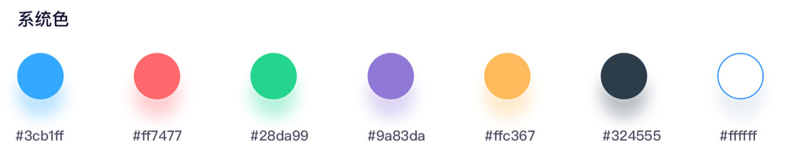

# zui

## 配色

```scss
$z-color:#3cb1ff;
$z-color-red:#ff7477;
$z-color-green:#28da99;
$z-color-purple:#9a83da;
$z-color-yellow:#ffc367;
$z-color-black:#324555;
$z-color-white:#ffffff;
```
## Project setup
```
npm install
```

### Compiles and hot-reloads for development
```
npm run serve
```

### Compiles and minifies for production
```
npm run build
```

### Run your tests
```
npm run test
```

### Lints and fixes files
```
npm run lint
```
